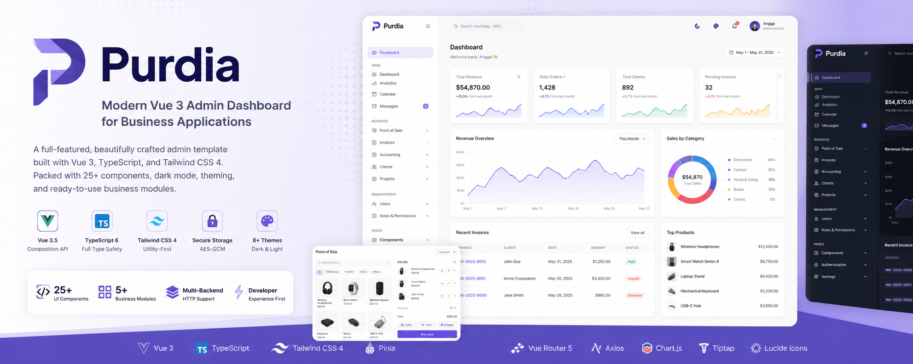

<p align="center">
  
</p>

<h1 align="center">Purdia</h1>

<p align="center">
Modern Vue 3 Admin Dashboard built with TypeScript & Tailwind CSS 4.
</p>

<p align="center">


</p>

---

## ✨ Features

- 🧩 **25+ UI Components** — Built from scratch, no external UI library
- 🌙 **Dark Mode** — Full light/dark theme with per-user persistence
- 🎨 **8 Color Themes** — Switchable primary colors (Indigo, Blue, Emerald, Rose, Amber, Teal, Violet, Slate)
- 🔐 **Secure Storage** — AES-GCM encrypted localStorage via Web Crypto API
- 🌐 **HTTP Helper** — Axios with auto token injection, silent refresh, multi-backend support
- 🔔 **Toast Notifications** — Global system with auto-dismiss, progress bar, API error integration
- 📦 **Composables** — `useApi`, `usePagination`, `useToast` for clean page logic
- 🛡️ **Authentication** — Login, Register, Forgot Password with encrypted token storage
- 📱 **Collapsible Sidebar** — Icon-only mode with flyout popover submenus

## 🖥️ Demo

> Mock auth enabled — any email/password combination works.

```bash
npm install && npm run dev
```

## 📦 Modules

### 📊 CRM — Customer Relationship Management

| Sub-module | Description                                                                       |
| ---------- | --------------------------------------------------------------------------------- |
| Dashboard  | Pipeline stats, recent deals, upcoming activities                                 |
| Leads      | Source tracking, status workflow (new → contacted → qualified → proposal → lost)  |
| Companies  | Industry, employee count, revenue tracking                                        |
| Contacts   | Company association, position, avatar                                             |
| Deals      | Pipeline stages, probability, value, close date                                   |
| Activities | Log calls, meetings, emails linked to contacts & deals                            |
| Follow Ups | Priority-based scheduler with due dates                                           |
| Tasks      | Assignee, priority, status (todo → in-progress → completed)                       |
| Quotations | Line items with auto-calculated totals, status (draft → sent → accepted/rejected) |
| Calendar   | Monthly calendar view with CRM events                                             |
| Reports    | Revenue charts, pipeline by stage, lead sources, top performers                   |

### 👥 HRM — Human Resource Management

| Sub-module    | Description                                                                 |
| ------------- | --------------------------------------------------------------------------- |
| Dashboard     | Employee stats, recent leave requests, birthdays, announcements             |
| Employees     | Tabbed form (personal, employment, bank & salary)                           |
| Departments   | Head, budget, employee count                                                |
| Positions     | Level (junior → manager), salary range                                      |
| Attendance    | Daily clock-in/out, status (present, late, absent, half-day)                |
| Leave         | Type (annual, sick, personal, maternity), approval workflow                 |
| Payroll       | Payslip with earnings/deductions breakdown, IDR currency                    |
| Recruitment   | Job postings, applicant tracking (screening → interview → offered/rejected) |
| Performance   | Quarterly reviews with rating, goals, feedback                              |
| Training      | Programs with participants, schedule, completion status                     |
| Assets        | Company asset tracking (laptops, monitors) with condition & assignment      |
| Documents     | Employee documents (contracts, certificates, IDs) with expiry tracking      |
| Expenses      | Claims with category, receipt, approval workflow                            |
| Announcements | Company-wide with type, priority, expiry                                    |
| Calendar      | Monthly calendar with birthdays, leave, training, holidays                  |
| Reports       | Attendance rate, headcount, leave by type, department budget analytics      |

### 🏪 Point of Sale

| Sub-module   | Description                                                                     |
| ------------ | ------------------------------------------------------------------------------- |
| Dashboard    | Sales overview and stats                                                        |
| POS Terminal | Product grid, favorites, inline discounts, multi-payment (Cash, Card, E-Wallet) |
| Stock        | Product inventory management                                                    |
| Customers    | Customer database                                                               |
| Cash Drawer  | Cash management                                                                 |
| Discounts    | Discount & promo management                                                     |
| Reports      | Sales reports and analytics                                                     |

### 📒 Accounting

| Sub-module           | Description                     |
| -------------------- | ------------------------------- |
| Dashboard            | Financial overview              |
| Chart of Accounts    | Account tree management         |
| Journal Entries      | Debit/credit journal entries    |
| General Ledger       | Account transaction history     |
| Financial Statements | Balance sheet, income statement |
| Tax Management       | Tax calculation and reporting   |

### 🧾 Invoices

| Sub-module   | Description                                   |
| ------------ | --------------------------------------------- |
| All Invoices | Full CRUD with line items and tax calculation |
| Unpaid       | Filtered view for pending payments            |
| Overdue      | Filtered view for overdue invoices            |

### 📋 Other Modules

| Module          | Description                                         |
| --------------- | --------------------------------------------------- |
| Clients         | Client CRUD with company/individual types, contacts |
| Projects        | Kanban board with drag-and-drop, task detail        |
| User Management | Users, Roles, Permissions with CRUD                 |

## 🧱 Component Library

All components live in `src/components/ui/` with full TypeScript props, variants, and sizes.

| Component   | Variants                                                      |
| ----------- | ------------------------------------------------------------- |
| Button      | primary, secondary, success, warning, danger, ghost, outline  |
| Card        | default, bordered, elevated, flat + flush mode                |
| Table       | default, striped, bordered + searchable, sortable, expandable |
| Badge       | primary, secondary, success, warning, danger, info            |
| Input       | default, filled, underlined                                   |
| Select      | single, multiple, remote/ajax, searchable, clearable          |
| Modal       | sm, md, lg, xl, full                                          |
| Alert       | info, success, warning, danger                                |
| Pagination  | default, simple, minimal, jumper                              |
| Tabs        | default, pills, underline, bordered                           |
| Date Picker | date, time, datetime, range                                   |
| Toggle      | sm, md, lg                                                    |
| Progress    | primary, success, warning, danger + striped, animated         |
| Skeleton    | text, circle, rect, button, avatar, badge, input              |
| Avatar      | xs, sm, md, lg, xl + circle, rounded, square                  |
| Dropdown    | 7 color variants + teleported positioning                     |
| Charts      | Line, Bar, Doughnut (Chart.js)                                |
| Breadcrumb  | chevron, slash, dot separators + sm, md, lg sizes + icons     |
| File Upload | dropzone, input, compact + progress, cancel, retry, validate  |
| Editor      | minimal, default, full (Tiptap WYSIWYG) + sm, md, lg sizes    |
| Toast       | success, error, warning, info + auto-dismiss, progress bar    |

**Sidebar Categories:**

| Category   | Components                                                               |
| ---------- | ------------------------------------------------------------------------ |
| Form       | Input, Select, Toggle, Date Picker, File Upload, Editor                  |
| Display    | Card, Badge, Avatar, Table, Alert, Progress, Stat Card, Skeleton, Charts |
| Navigation | Button, Tabs, Pagination, Breadcrumb                                     |
| Layout     | Modal, Grid                                                              |

## 🛠 Tech Stack

| Technology   | Version | Purpose                                         |
| ------------ | ------- | ----------------------------------------------- |
| Vue          | 3.5     | Composition API, `<script setup>`               |
| TypeScript   | 6       | Full type safety                                |
| Tailwind CSS | 4       | Utility-first styling with CSS variable theming |
| Pinia        | 3       | State management (auth, theme, toast)           |
| Vue Router   | 5       | File-based route modules, async guards          |
| Axios        | 1.x     | HTTP client with interceptors                   |
| Chart.js     | 4       | Data visualization                              |
| Tiptap       | 3       | Headless WYSIWYG editor                         |
| Lucide       | 1.x     | 1000+ icons                                     |
| Vite         | 8       | Dev server and build tool                       |

## 🚀 Installation

```bash
# Clone the repository
git clone https://github.com/anggagewor/purdia.git
cd purdia

# Install dependencies
npm install

# Start development server
npm run dev

# Type-check and build for production
npm run build

# Preview production build
npm run preview
```

## 📁 Project Structure

```
src/
├── assets/              # Global CSS (Tailwind config, dark mode, color themes)
├── components/
│   ├── ui/              # 25+ reusable UI components
│   ├── charts/          # Chart wrappers (Line, Bar, Doughnut)
│   └── layout/          # DashboardLayout, SidebarNav, TopBar
├── composables/
│   ├── useApi.ts        # Generic loading/error/data composable
│   ├── usePagination.ts # Paginated list with search, sort, filters
│   └── useToast.ts      # Programmatic toast notifications
├── lib/
│   ├── config.ts        # Multi-backend API configuration
│   ├── crypto.ts        # Secure storage (AES-GCM encrypt/decrypt)
│   └── http.ts          # Axios instance with interceptors + silent refresh
├── pages/
│   ├── auth/            # Login, Register, Forgot Password
│   ├── accounting/      # Chart of Accounts, Journals, Ledger, Statements, Tax
│   ├── clients/         # Client CRUD (company & individual)
│   ├── crm/             # CRM (11 sub-modules, 35 pages)
│   ├── hrm/             # HRM (16 sub-modules, 47 pages)
│   ├── invoices/        # Invoice CRUD + filtered views
│   ├── pos/             # POS Terminal, Stock, Customers, Reports
│   ├── projects/        # Kanban board, Task Detail
│   ├── users/           # Users, Roles, Permissions
│   └── examples/        # Component showcase pages
├── router/
│   └── routes/          # Route modules per feature
└── stores/              # Pinia stores (auth, theme, toast)
```

## 🤝 Contributing

Contributions are welcome! Feel free to open issues or submit pull requests.

1. Fork the repository
2. Create your feature branch (`git checkout -b feature/amazing-feature`)
3. Commit your changes (`git commit -m 'Add amazing feature'`)
4. Push to the branch (`git push origin feature/amazing-feature`)
5. Open a Pull Request

## 📄 License

MIT License — free to use, modify, and distribute.
